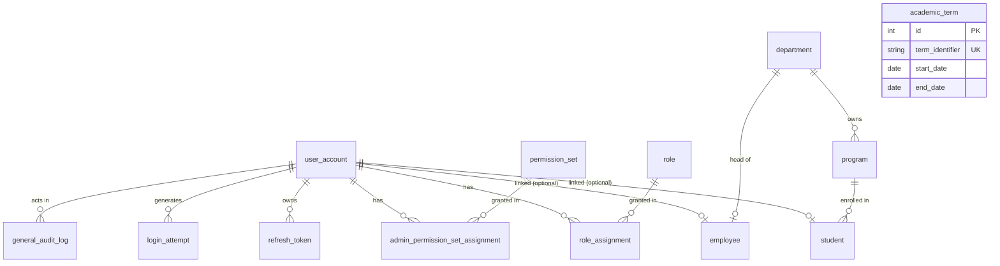

# M1: Core Module ER Diagram

```mermaid
erDiagram
    user_account ||--o| student : "linked (optional)"
    user_account ||--o| employee : "linked (optional)"
    user_account ||--o{ role_assignment : "has"
    user_account ||--o{ admin_permission_set_assignment : "has"
    user_account ||--o{ refresh_token : "owns"
    user_account ||--o{ login_attempt : "generates"
    user_account ||--o{ general_audit_log : "acts in"
    
    role ||--o{ role_assignment : "granted in"
    permission_set ||--o{ admin_permission_set_assignment : "granted in"
    
    department ||--o{ program : "owns"
    department ||--o| employee : "head of"
    
    program ||--o{ student : "enrolled in"
    
    academic_term {
        int id PK
        string term_identifier UK
        date start_date
        date end_date
    }
```
