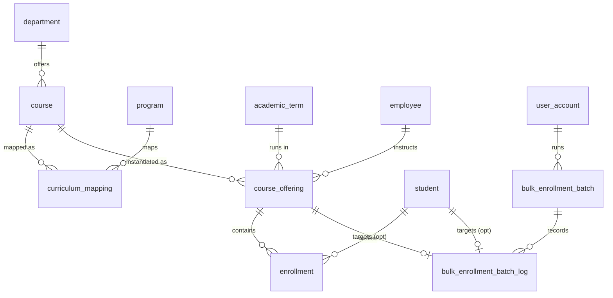

# M2: Academics and Enrollment ER Diagram

```mermaid
erDiagram
    department ||--o{ course : "offers"
    program ||--o{ curriculum_mapping : "maps"
    course ||--o{ curriculum_mapping : "mapped as"
    
    course ||--o{ course_offering : "instantiated as"
    academic_term ||--o{ course_offering : "runs in"
    employee ||--o{ course_offering : "instructs"
    
    student ||--o{ enrollment : "makes"
    course_offering ||--o{ enrollment : "contains"
    
    user_account ||--o{ bulk_enrollment_batch : "runs"
    bulk_enrollment_batch ||--o{ bulk_enrollment_batch_log : "records"
    student ||--o| bulk_enrollment_batch_log : "targets (opt)"
    course_offering ||--o| bulk_enrollment_batch_log : "targets (opt)"
```
