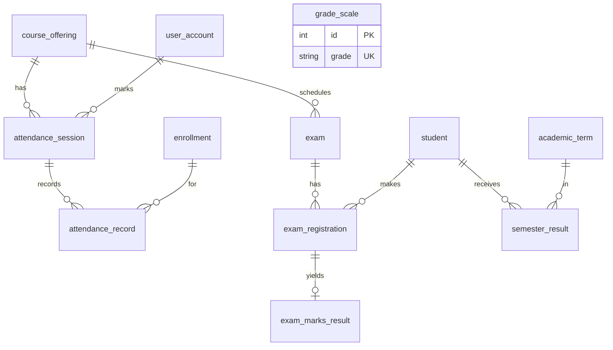

# M3: Attendance, Exams, and Results ER Diagram

```mermaid
erDiagram
    course_offering ||--o{ attendance_session : "has"
    user_account ||--o{ attendance_session : "marks"
    attendance_session ||--o{ attendance_record : "records"
    enrollment ||--o{ attendance_record : "for"
    
    course_offering ||--o{ exam : "schedules"
    exam ||--o{ exam_registration : "has"
    student ||--o{ exam_registration : "makes"
    
    exam_registration ||--o| exam_marks_result : "yields"
    
    student ||--o{ semester_result : "receives"
    academic_term ||--o{ semester_result : "in"
    
    grade_scale {
        int id PK
        string grade UK
    }
```
