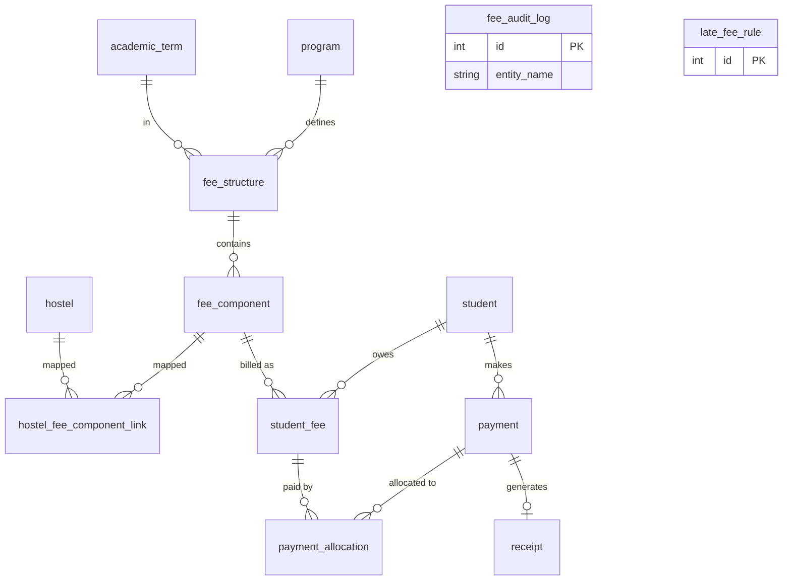

# M4: Finance ER Diagram

```mermaid
erDiagram
    program ||--o{ fee_structure : "defines"
    academic_term ||--o{ fee_structure : "in"
    fee_structure ||--o{ fee_component : "contains"
    
    fee_component ||--o{ hostel_fee_component_link : "mapped"
    hostel ||--o{ hostel_fee_component_link : "mapped"
    
    student ||--o{ student_fee : "owes"
    fee_component ||--o{ student_fee : "billed as"
    
    student ||--o{ payment : "makes"
    payment ||--o{ payment_allocation : "allocated to"
    student_fee ||--o{ payment_allocation : "paid by"
    
    payment ||--o| receipt : "generates"
    
    fee_audit_log {
        int id PK
        string entity_name
    }
    
    late_fee_rule {
        int id PK
    }
```
