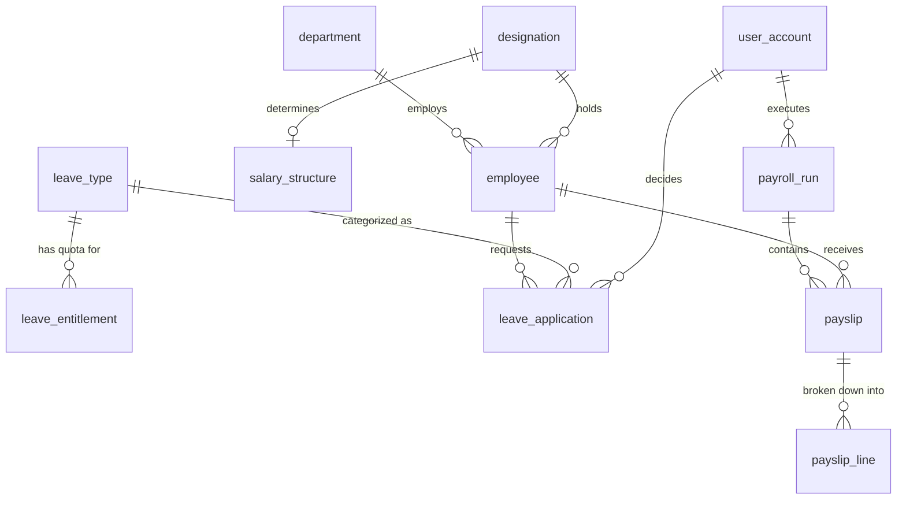

# M5: HR, Leave, and Payroll ER Diagram

```mermaid
erDiagram
    department ||--o{ employee : "employs"
    designation ||--o{ employee : "holds"
    designation ||--o| salary_structure : "determines"
    
    leave_type ||--o{ leave_entitlement : "has quota for"
    
    employee ||--o{ leave_application : "requests"
    leave_type ||--o{ leave_application : "categorized as"
    user_account ||--o{ leave_application : "decides"
    
    user_account ||--o{ payroll_run : "executes"
    payroll_run ||--o{ payslip : "contains"
    employee ||--o{ payslip : "receives"
    payslip ||--o{ payslip_line : "broken down into"
```
