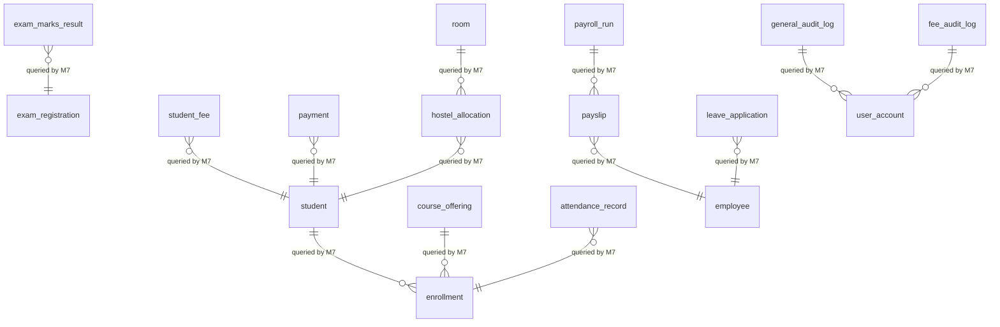

# M7: Analytics and Audit Data Sources

M7 is comprised entirely of views and complex queries.
The diagram below shows the primary tables queried by the M7 reports.

```mermaid
erDiagram
    student ||--o{ enrollment : "queried by M7"
    course_offering ||--o{ enrollment : "queried by M7"
    attendance_record }o--|| enrollment : "queried by M7"
    exam_marks_result }o--|| exam_registration : "queried by M7"
    student_fee }o--|| student : "queried by M7"
    payment }o--|| student : "queried by M7"
    hostel_allocation }o--|| student : "queried by M7"
    room ||--o{ hostel_allocation : "queried by M7"
    payroll_run ||--o{ payslip : "queried by M7"
    payslip }o--|| employee : "queried by M7"
    leave_application }o--|| employee : "queried by M7"
    general_audit_log ||--o{ user_account : "queried by M7"
    fee_audit_log ||--o{ user_account : "queried by M7"
```
