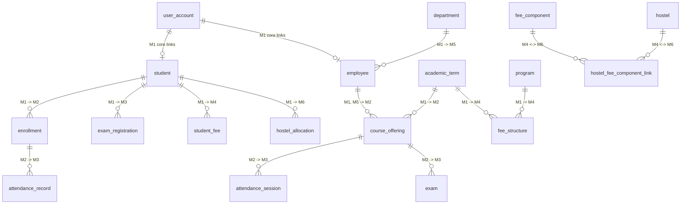

# Cross-Module Overview ER Diagram

```mermaid
erDiagram
    user_account ||--o| student : "M1 core links"
    user_account ||--o| employee : "M1 core links"
    
    student ||--o{ enrollment : "M1 -> M2"
    academic_term ||--o{ course_offering : "M1 -> M2"
    employee ||--o{ course_offering : "M1, M5 -> M2"
    
    course_offering ||--o{ attendance_session : "M2 -> M3"
    enrollment ||--o{ attendance_record : "M2 -> M3"
    course_offering ||--o{ exam : "M2 -> M3"
    
    student ||--o{ exam_registration : "M1 -> M3"
    
    program ||--o{ fee_structure : "M1 -> M4"
    academic_term ||--o{ fee_structure : "M1 -> M4"
    student ||--o{ student_fee : "M1 -> M4"
    
    fee_component ||--o{ hostel_fee_component_link : "M4 <-> M6"
    hostel ||--o{ hostel_fee_component_link : "M4 <-> M6"
    
    student ||--o{ hostel_allocation : "M1 -> M6"
    
    department ||--o{ employee : "M1 -> M5"
```
